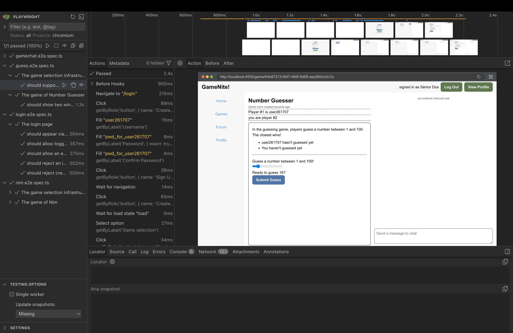
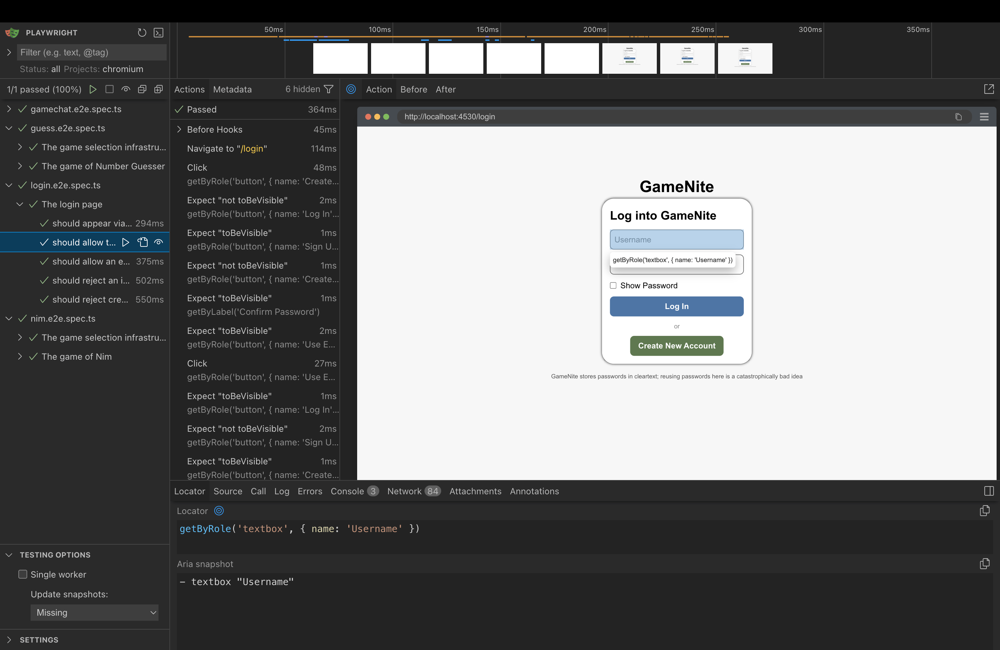

Testing web applications has always been tricky: web applications run inside of the browser, and browsers are complicated pieces of software. Many pieces of software have been created to provide a test double for the browser and the browser's DOM (Document Object Model). However, the current trend in the mid-2020s is to directly run tests in the browser, and [Playwright](https://playwright.dev/docs/intro) is a popular tool that facilitates running these tests.

This guide isn't intended to replace the [Playwright docs](https://playwright.dev/docs/intro), it's just intended to give an extremely brief introduction to how Playwright can be used in this course. 

## Running Playwright tests

In our course projects, Playwright tests can be run in two ways:

 - `npm run test` in the `client` directory runs the tests automatically (this is called "headless mode" for obscure reasons). When tests finish, Playwright generates an HTML report in a `playwright-report` directory.
 - `npm run playwright` in the `client` directory runs the tests in an interactive UI mode.

When Playwright runs, it will check whether you are already running the development Express server (`npm run dev -w=server` in the root directory or `npm run dev` in the `server` directory) and the development Vite frontend server (`npm run dev -w=client` in the root directory or `npm run dev` in the `client` directory). If it's not, Playwright will start them. But if you are running the Express server yourself, you can see the server responding to Playwright's actions.

Playwright's UI is extremely useful. You can use it to help you:
- **Write new tests:** Watch mode re-runs tests as you edit
- **Debugging failures:** Step through each action, see the page state at every moment
- **Discovering selectors:** Use the "Pick locator" tool to find the right selector for any element

UI mode is your best friend when a test fails and you don't know why. You can see exactly what the page looked like when an assertion failed.

See [Playwright UI Mode docs](https://playwright.dev/docs/test-ui-mode) for a full walkthrough.

## Example

Here's an example of using Playwright to log in to the home page. 

```ts
// From login.e2e.spec.ts - testing successful login
test('should allow an existing user to log in', async ({ page }) => {
  // Assemble
  await page.goto('/login');
  await page.getByLabel('Username').fill("user3");
  await page.getByLabel('Password', { exact: true }).fill("pwd3333");

  // Act
  await page.getByRole('button', { name: 'Log In' }).click();

  // Assess
  await page.waitForURL('/');
  await expect(page.getByText('signed in as Frau Drei')).toBeVisible();
});
```

This short code demonstrates several types of Playwright actions: 

 - Navigating to different pages and waiting for URLs to change
 - Locating elements on a page (like the field for entering username, or the button for logging in)
 - Interacting with elements on a page
 - Testing assertions about an element on a page

## Locating Elements on a Page

A lot of the challenge of browser UI testing in general is locating elements on a web page. Ideally, tests should interact with web pages the way a human user does—by looking for buttons, clicking on labeled fields, and reading visible text.

This is where **accessibility** comes in. [ARIA (Accessible Rich Internet Applications)](https://developer.mozilla.org/en-US/docs/Web/Accessibility/ARIA) is a set of attributes that make web content more accessible to people using assistive technologies like screen readers. The key insight is: **if a website is accessible to screen readers, it's more likely to be accessible to automated tests.**

Playwright's locator methods are designed around this principle:

- `getByRole()` finds elements by their ARIA role (button, link, textbox, etc.)
- `getByLabel()` finds form inputs by their associated label text; associating form input fields with a label is a good accessibility practice
- `getByText()` finds elements by their visible text content

This creates a virtuous cycle: writing good Playwright tests pushes you toward building more accessible websites, and accessible websites are easier to test.

**Rule of thumb:** If a test is hard to write, your first impulse should be to improve the component's accessibility (add labels, use semantic HTML).

### Discovering Selectors

**Option 1: Playwright UI mode (recommended)**

Run `npm run playwright` to open the interactive test runner. After running a test, you can click on any action step to see the page state at that moment:



Use the "Pick locator" tool to click on any element. Playwright will suggest the best selector automatically. In this example, clicking on the Username field shows `getByRole('textbox', { name: 'Username' })`:



**Option 2: Browser DevTools**

1. Right-click an element → Inspect
2. Look for `aria-label`, `role`, `placeholder`, or visible text
3. Map what you find to the appropriate `getBy*` method:

| What you see in HTML | Playwright method |
|---------------------|-------------------|
| `aria-label="Username"` | `getByLabel('Username')` |
| `placeholder="Send a message to chat"` | `getByPlaceholder('Send a message to chat')` |
| `role="button"` with text "Log In" | `getByRole('button', { name: 'Log In' })` |
| `role="listitem"` | `getByRole('listitem')` |
| Visible text "signed in as..." | `getByText('signed in as...')` |

### Implicit ARIA Roles

You don't need an explicit `role` attribute in the HTML for `getByRole()` to work. A `<button>` element is found by `getByRole('button')` because of its implicit role, so when you write `page.getByRole('button', { name: 'Log In' })`, Playwright will find any `<button>` element with that accessible name. No explicit `role` attribute is necessary.

Here are some other examples:

| HTML Element | Implicit ARIA Role |
|--------------|-------------------|
| `<button>` | `button` |
| `<a href="...">` | `link` |
| `<input type="text">` | `textbox` |
| `<input type="checkbox">` | `checkbox` |
| `<h1>` through `<h6>` | `heading` |
| `<ul>`, `<ol>` | `list` |
| `<li>` | `listitem` |

See [MDN's ARIA roles reference](https://developer.mozilla.org/en-US/docs/Web/Accessibility/ARIA/Roles) for a complete list, or [Playwright's Locate by role guide](https://playwright.dev/docs/locators#locate-by-role) for testing-specific examples.

### Avoiding CSS or XPATH Selectors

There are other ways of locating objects on a page; online sources or ChatGPT will probably give you code that uses `.locator` method a lot. Playwright's docs suggest against this and we do too, as it describes [in the docs on `.locator`](https://playwright.dev/docs/locators#locate-by-css-or-xpath) .

### Filtering and Chaining

When multiple elements match, narrow down with `.filter()`:

```ts
// From testutils.ts - find the specific list item containing a username, then click its link
await page2.getByRole('listitem').filter({ hasText: username1 }).getByRole('link').click();
```

See [Playwright Locators docs](https://playwright.dev/docs/locators) for more filtering options.

## Interacting With Elements on a Page

One of the things that Playwright does quite well is handle interactions with page elements. If an action can't be taken right away, Playwright will generally wait until the action becomes available. A few cases need explicit waits, and this is one of the trickier parts of Playwright—it works so well most of the time that the exceptions can be surprising.

### String Matching and `{ exact: true }`

By default, Playwright's locators use **substring matching**. This is usually convenient, but can cause problems when multiple elements contain similar text:

```ts
// If the page has both "Password" and "Show Password" labels:
page.getByLabel('Password')  // ❌ Might match either element!

// Use exact matching to be precise:
page.getByLabel('Password', { exact: true })  // ✅ Only matches "Password" exactly
```

Use `{ exact: true }` when:
- A shorter label is a substring of a longer one (like "Password" vs "Confirm Password")
- You need to distinguish between similar elements
- You want the test to fail if the exact text changes

### Auto-Waiting for Actions

Clicking and filling elements will automatically wait for the element to be visible and actionable:

```ts
await page.getByLabel('Username').fill('user3');
await page.getByRole('button', { name: 'Log In' }).click();
```

Sometimes, you need explicit waits.

**After navigation or redirects:** Actions like clicking a login button trigger a redirect, but the action itself completes immediately. Use `waitForURL` to explicitly wait for the navigation to finish before continuing.

```ts
// From login.e2e.spec.ts
await page.getByRole('button', { name: 'Log In' }).click();  // Click completes, redirect starts
await page.waitForURL('/');  // Explicitly wait for redirect to complete
await expect(page.getByText('signed in as Frau Drei')).toBeVisible();
```

**After WebSocket updates:** When another user's action updates your UI (common in multiplayer games), wait on the resulting UI change:

```ts
// Pattern for multiplayer games - after player 1 acts, verify player 2's UI updates
await page1.getByRole('button', { name: 'Take three' }).click();
await expect(page2.getByRole('button', { name: 'Take one' })).toBeEnabled();  // Wait for WebSocket update
```

**When data loads asynchronously:** If a component renders after fetching data, wait on the element you need:

```ts
// From testutils.ts - wait for the chat input to confirm game page loaded
await page1.getByPlaceholder('Send a message to chat').click();
```

The rule of thumb is: when auto-wait isn't enough, use `await expect(...)` assertions, because these consistently retry until the condition is met or timeout. See [Auto-retrying assertions](https://playwright.dev/docs/test-assertions#auto-retrying-assertions) in the Playwright docs for more details.

## Assertions

Assertions in Playwright work differently than you might expect from vitest. Instead of checking a condition once and immediately passing or failing, Playwright assertions **automatically retry** until the condition is met or a timeout is reached.

This is essential for testing dynamic web applications where elements might take time to appear, update, or become interactive. You don't need to add manual delays or polling—just write what you expect, and Playwright handles the waiting.

```ts
// These assertions will retry until they pass (or timeout after ~5 seconds by default)
await expect(element).toBeVisible();
await expect(element).toBeEnabled();
await expect(element).toHaveText('expected');
await expect(element).toBeDisabled();
await expect(element).not.toBeVisible();
```

See the [Playwright Assertions documentation](https://playwright.dev/docs/test-assertions) for a complete list of available matchers.

## Debugging Failed Tests

Test failures happen. Here's how to diagnose them efficiently.

### 1. Read the Error Message

Playwright's error messages are detailed. Look for:
- **Which assertion failed:** e.g., `expect(locator).toBeVisible()`
- **What it was waiting for:** e.g., `Locator: getByRole('button', { name: 'Start Game' })`
- **Timeout:** If it says "Timeout 30000ms exceeded," the element never appeared

```
Error: expect(locator).toBeVisible()

Locator: getByRole('button', { name: 'Start Game' })
Expected: visible
Received: <element not found>
Call log:
  - waiting for getByRole('button', { name: 'Start Game' })
```

### 2. Check the HTML Report

After `npm run test` fails, Playwright generates a report:

```
client/playwright-report/index.html
```

Open it in a browser. The report shows:
- ✅ / ❌ status for each test
- **Error details** with the full call log
- **Source location** of the failing line

> Note: Screenshots and traces are not captured by default. The current config only generates the basic HTML report. If you need these, you'd enable them in `playwright.config.mjs`.

### 3. Reproduce in UI Mode

Run the failing test in UI mode for interactive debugging:

```bash
npm run playwright
```

In UI mode you can:
- **Watch the test run** in a real browser
- **Pause on any step** and inspect the page
- **See the DOM state** at each action
- **Use "Pick locator"** to verify your selectors match what you expect

### 4. Common Failure Patterns

| Symptom | Likely cause | Fix |
|---------|--------------|-----|
| "Element not found" | Selector doesn't match | Use UI mode's "Pick locator" to find the right selector |
| "Element not visible" | Element exists but hidden/covered | Check if something is overlaying it, or wait for animation |
| Timeout after navigation | Missing `waitForURL` | Add `await page.waitForURL('/expected-path')` |
| Flaky (passes sometimes) | Race condition with async data | Add `await expect(...)` on the element before interacting |
| Works locally, fails in CI | Server not ready | Check `webServer` config in `playwright.config.mjs` |

### 5. Isolate the Problem

Run just the failing test:

```bash
# In UI mode - click on the specific test
npm run playwright

# Or from command line
npx playwright test -g "test name here"
```

UI mode is the best debugging tool—you can pause on any step, inspect the page, and see exactly what Playwright sees. Prefer this over adding debug code to your tests.

### 6. Check if It's a UI Bug

Sometimes the test is correct but the UI has a bug. Before spending hours on the test:
1. Run the app manually (`npm run dev` in both `client/` and `server/`)
2. Try the exact flow your test is doing
3. If the UI doesn't work manually, fix the UI first

## References

| Documentation | What It Covers |
|------|----------------|
| [Test intro](https://playwright.dev/docs/test-intro) | Basic test structure, running tests |
| [UI Mode](https://playwright.dev/docs/test-ui-mode) | Interactive debugging, watch mode |
| [Locators](https://playwright.dev/docs/locators) | All `getBy*` methods, filtering, chaining |
| [getByRole reference](https://playwright.dev/docs/api/class-page#page-get-by-role) | Role names, options like `{ name, exact }` |
| [Actionability](https://playwright.dev/docs/actionability) | How auto-wait works, what Playwright checks |
| [Assertions](https://playwright.dev/docs/test-assertions) | All `expect()` matchers: `toBeVisible`, `toHaveText`, etc. |

## GameNite-Specific Tips

### Test Utilities

The file `client/tests/end-to-end/testutils.ts` provides helper functions to reduce boilerplate in tests:

**`logInUser(page, username, password)`** - Logs in an existing user and waits for the redirect to complete:

```ts
import { logInUser } from './testutils.ts';

await logInUser(page, 'user2', 'pwd2222');
// User is now logged in and on the home page
```

**`createAndLoadGame(page1, page2, gameId, gameStartsAutomatically, doAssess)`** - Sets up a complete two-player game session:

```ts
import { createAndLoadGame } from './testutils.ts';

// In beforeEach:
await createAndLoadGame(page1, page2, 'nim', true, false);
// Both players are now in a started game, ready for gameplay tests
```

Parameters:
- `page1`, `page2`: Two separate browser pages (from different browser contexts)
- `gameId`: The game type (`'nim'`, `'guess'`, etc.)
- `gameStartsAutomatically`: `true` if the game starts when 2 players join (like Nim), `false` if a "Start Game" button must be clicked
- `doAssess`: `true` adds extra assertions during setup (useful for testing the setup flow itself)

The helper creates a random new user for `page1` to avoid test collisions, while `page2` uses the seeded `user2` account.

### Seed Users

The server seeds these test users on startup:

| Username | Password | Display Name |
|----------|----------|---------------|
| `user0` | `pwd0000` | The Knight Of Games |
| `user1` | `pwd1111` | Yāo |
| `user2` | `pwd2222` | Sénior Dos |
| `user3` | `pwd3333` | Frau Drei |


- **Always `waitForURL` after login/navigation.** The redirect happens async.
- **Create random usernames in tests.** Avoids collisions: `'user' + Math.floor(Math.random() * 1_000_000)` helps avoid “User already exists” when the test creates accounts.
- **Test display names, not usernames.** The UI shows "Frau Drei", not "user3".
- **WebSocket updates need explicit waits.** After one player acts, wait for the other player's UI to update.
- **The server resets on restart (in dev mode).** If your test data seems stale, restart the dev server. (Note: This only applies to the default in-memory setup. With MongoDB configured, data persists across restarts.)